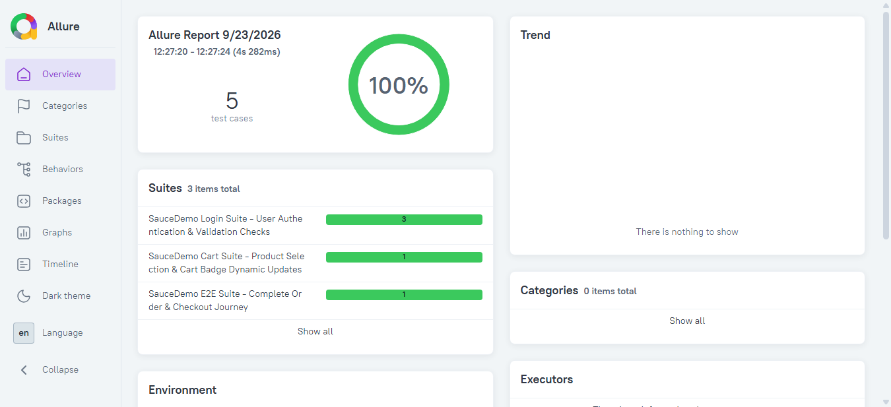
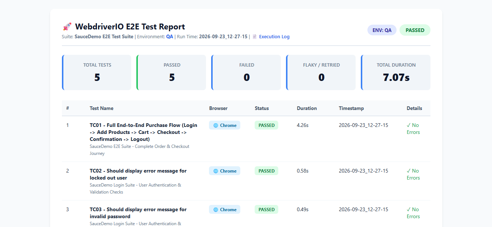
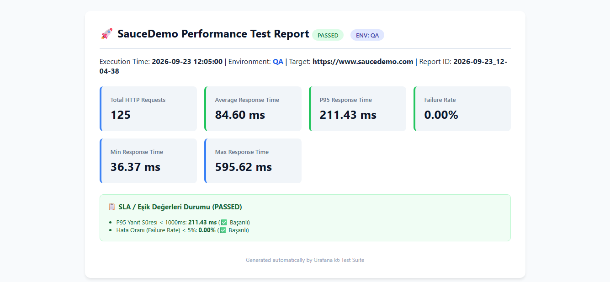

# 🚀 SauceDemo WebdriverIO (TypeScript) & k6 (JavaScript) Test Automation Project

Bu proje, [SauceDemo](https://www.saucedemo.com/) e-ticaret platformu için geliştirilmiş; **WebdriverIO (TypeScript)** ile UI uçtan uca (E2E) web otomasyonunu ve **Grafana k6 (JavaScript)** ile yük/performans testlerini bir araya getiren, modern, sürdürülebilir, modüler ve kurumsal standartlarda bir test otomasyon projesidir.

---

## 📑 İçindekiler
- [🛠️ Teknoloji Yığını (Tech Stack)](#️-teknoloji-yığını-tech-stack)
- [✨ Öne Çıkan Özellikler ve Yetenekler (Key Features)](#-öne-çıkan-özellikler-ve-yetenekler-key-features)
- [📂 Proje Mimarisi](#-proje-mimarisi)
- [🧪 Test Senaryoları](#-test-senaryoları)
- [📊 Performans Eşik Değerleri (Thresholds)](#-performans-eşik-değerleri-thresholds)
- [⚙️ Kurulum ve Ön Koşullar](#️-kurulum-ve-ön-koşullar)
- [🌐 Çoklu Test Ortamı Desteği (Multi-Environment)](#-çoklu-test-ortamı-desteği-multi-environment)
- [🚀 Testleri Çalıştırma](#-testleri-çalıştırma)
- [📊 Rapor Vitrini ve Örnek Çıktılar (Showcase)](#-rapor-vitrini--örnek-çıktılar-reporting-showcase)
- [📈 Raporlama Çıktıları](#-raporlama-çıktıları-reports-structure)
- [🔄 CI/CD Pipeline Entegrasyonu](#-cicd-pipeline-entegrasyonu-github-actions)
- [🐳 Docker ile Konteynerize Test Koşumu](#-docker-ile-konteynerize-test-koşumu)
- [🎯 Tasarım Prensipleri](#-tasarım-prensipleri)
- [📝 Geliştirme Notları ve Yapılan İşlemler (Engineering Log)](#-geliştirme-notları-ve-yapılan-işlemler-engineering-log)

---

## 🛠️ Teknoloji Yığını (Tech Stack)

| Kategori | Teknoloji / Kütüphane | Açıklama |
| :--- | :--- | :--- |
| **Web Test Runner** | [WebdriverIO v9](https://webdriver.io/) | Modern W3C WebDriver ve Bidi protokol destekli E2E test framework'ü |
| **Dil (E2E)** | [TypeScript 5](https://www.typescriptlang.org/) | Tip güvenli (Type-safe), sürdürülebilir nesne yönelimli kodlama |
| **Test Framework** | [Mocha](https://mochajs.org/) + BDD Expect | BDD tarzı `describe`, `it` ve `expect` assertion kütüphanesi |
| **Raporlama (Allure)** | [Allure Reporter](https://allurereport.org/) | Tek dosya (`--single-file`) interaktif HTML test portalı ve zaman çizelgesi |
| **Raporlama (Excel)** | [ExcelJS](https://github.com/exceljs/exceljs) | Yönetici ve QA ekipleri için renkli KPI kartlı kurumsal `.xlsx` dashboard motoru |
| **Performans Testi** | [Grafana k6](https://k6.io/) | Yüksek performanslı Go tabanlı, JavaScript ile yazılan yük testi aracı |
| **Tasarım Deseni** | [Page Object Model (POM)](https://martinfowler.com/bliki/PageObjectModel.html) | UI elemanları ile test adımlarını kesin hatlarla ayrıştıran mimari |
| **CI/CD** | GitHub Actions | Ubuntu üzerinde çoklu ortam, k6, Java 17 ve Allure artefakt pipeline'ı |

---

## ✨ Öne Çıkan Özellikler ve Yetenekler (Key Features)

Projede geliştirilen ve kullanıma sunulan temel özellikler:

* **🖥️ Canlı Ekran İzleme & Headless Mod Desteği:**
  * `npm run test:e2e:headed` komutu ile Chrome tarayıcısı ekranda açılarak tüm satın alma akışı (tıklamalar, form doldurma, sepet kontrolleri) canlı izlenebilir.
  * `npm run test:e2e` komutu ile arka planda hızlı ve kaynak tüketmeyen headless test koşumu sağlanır.
* **📂 Domain-Based Sayfa Mimarisi & Barrel Export:**
  * Her bir web sayfası kendine ait bağımsız bir klasörde (`login/`, `inventory/`, `cart/`, `checkout-step-one/`, `checkout-step-two/`, `checkout-complete/`) yapılandırılmıştır.
  * `src/pages/index.ts` merkezi barrel export dosyası sayesinde test senaryolarında import satırları tek satıra indirilmiştir.
* **⚡ Grafana k6 ile Çok Aşamalı Performans Testi:**
  * SauceDemo React SPA mimarisine uygun şekilde HTML dokümanı, CSS paketi, React JS bundle, Web manifest ve Favicon varlıkları için aşamalı (Ramp-up $\rightarrow$ Steady $\rightarrow$ Ramp-down) yük testi.
  * Yanıt süreleri ($p_{95} < 1000\text{ ms}$), hata oranı ($< \%5$) ve doğrulama metriklerinin takibi.
* **📊 Otomatik HTML Dashboard & JSON Performans Raporlama:**
  * k6 koşumu tamamlandığında `reports/performance/html/YYYY-MM-DD_HH-mm-ss.html` dosyasında modern kartlı bir HTML dashboard raporu otomatik üretilir.
  * CI/CD entegrasyonu ve metrik analizleri için `reports/performance/k6-summary.json` metrik dosyası oluşturulur.
* **🛡️ Flaky-Free Dayanıklı Bekleme Mekanizması (Resilient Waiting):**
  * SPA sayfa geçişlerinde yarış durumlarını (race condition) ve kararsız testleri önlemek amacıyla `BasePage` sınıfında dinamik 10 saniyelik görünürlük beklemesi (`waitForDisplayed`) entegre edilmiştir.
* **📝 Kurumsal Çift Akışlı Loglama Mekanizması (Multi-Stream Logger):**
  * Hem terminale renkli ve emojili çıktı basan, hem de eşzamanlı olarak `reports/e2e/logs/YYYY-MM-DD_HH-mm-ss.log` ve `reports/e2e/logs/e2e-execution.log` kalıcı dosyalarına temiz (ANSI-free) formatta yazan gelişmiş logger (`src/utils/logger.ts`).
  * `DEBUG`, `INFO`, `STEP`, `WARN`, `ERROR` seviye desteği ve `LOG_LEVEL` filtreleme özelliği.
  * WDIO yaşam döngüsü hook'ları (`beforeSuite`, `beforeTest`, `afterTest`, `afterSuite`) ile tam entegre; fail anında hata stack trace'i ve ekran görüntüsü referanslarını otomatik loglar.
  * E2E HTML raporu başlığında tek tıkla doğrudan açılabilen **"📄 Execution Log"** bağlantısı.
  * Performans koşuları için de k6 runner üzerinden `reports/performance/logs/` altında oturum ve kümülatif loglama.
* **🏷️ Merkezi Sabitler ve Test Verisi İzolasyonu:**
  * URL rotaları (`src/constants/routes.ts`), UI başlık ve metinleri (`src/constants/messages.ts`), kullanıcı ve sipariş verileri (`src/data/testData.ts`) test kodlarından tamamen ayrıştırılmıştır.
* **🛠️ Akıllı k6 Koşucu Betiği (`scripts/run-k6.js`):**
  * Windows üzerindeki boşluklu dizin (`C:\Program Files\k6\k6.exe`) sorunlarını otomatik çözen ve platform fark etmeksizin çalışan runner betiği.
* **🌐 Çoklu Test Ortamı Desteği (Multi-Environment: DEV, QA, STAGING, PROD):**
  * Hem WebdriverIO E2E hem de k6 Performans testleri tek bir bayrakla (`TEST_ENV=staging` veya `--env=staging`) farklı test ortamlarında çalıştırılabilir.
  * Ortama özel Base URL'ler, timeout değerleri, kullanıcı havuzu ve SLA süreleri `src/config/environment.ts` dosyasından dinamik yönetilir.
  * Üretilen E2E ve k6 HTML raporlarında aktif ortam rozeti (`ENV: QA`, `ENV: STAGING`, `ENV: PROD`) otomatik gösterilir.
* **🔁 Otomatik Yeniden Deneme (Retry Mechanism - Varsayılan: 2):**
  * Ağ gecikmeleri veya anlık DOM dalgalanmalarından kaynaklı flaky testleri engellemek için test seviyesinde (`mochaOpts.retries: 2`) ve dosya seviyesinde (`specFileRetries: 2`) iki katmanlı retry motoru.
  * Test ara adımda fail olursa konsola `⚠️ [Retry Engine] ... Retrying...` basılır; hata ekran görüntüsü yalnızca son deneme de başarısız olursa yakalanır.
  * Flaky geçen testler HTML raporunda şeffaf bir şekilde `PASSED (FLAKY) - Resolved after retry` olarak gösterilir.
* **⚡ Eşzamanlı Paralel Test Koşumu (Parallel Execution - Varsayılan: 3 Worker):**
  * Bağımsız spec dosyalarını aynı anda farklı tarayıcı worker süreçlerinde koşturarak test paketinin toplam çalışma süresini dramatik biçimde kısaltır.
  * `maxInstances` ortam değişkeni (`MAX_INSTANCES=3`) veya doğrudan paralel çalıştırma scriptleri (`npm run test:e2e:parallel:staging`).
  * Çoklu iş parçacığı tarafından üretilen test sonuçlarını tek bir raporda toplayan **Birleşik Paralel HTML Raporu** ve worker etiketli ortak loglama (`[0-0]`, `[0-1]`, `[0-2]`).
* **🌐 Çapraz Tarayıcı Desteği (Cross-Browser: Chrome, Edge, Firefox):**
  * `BROWSER` parametresi (`chrome`, `edge`, `firefox`, `all`) ile tekli tarayıcı veya eşzamanlı tarayıcı matrisi testi.
  * Tarayıcıya özel W3C yetenekleri (`goog:chromeOptions`, `ms:edgeOptions`, `moz:firefoxOptions`) ile hem headless hem headed desteği.
  * HTML dashboard raporunda her test sonucunun yanında dinamik `🌐 Chrome`, `🌊 Edge`, `🦊 Firefox` rozet gösterimi.
* **🔄 GitHub Actions CI/CD Pipeline:**
  * Kod push veya pull request yapıldığında hem E2E hem performans testlerini Ubuntu ortamında koşturan ve raporları saklayan pipeline (`.github/workflows/github-actions.yml`).
* **🏆 Bağımsız Allure Reporter (Tek Dosya Standalone HTML):**
  * Her E2E test koşumunun ardından `reports/allure-report/YYYY-MM-DD_HH-mm-ss.html` formatında otomatik derlenen, sunucu/CORS gerektirmeden çift tıklamayla doğrudan tarayıcıda açılan, zaman çizelgeli (Timeline) ve hiyerarşik adım ağaçlı Allure portalı.
* **📊 Yönetici ve QA Excel Raporlama (`.xlsx` Dashboard):**
  * E2E testleri için `reports/e2e/excel/`, k6 performans testleri için `reports/performance/excel/` altında kurumsal ExcelJS motoru ile üretilen çift sayfalı çalışma kitapları.
  * Renkli KPI kartları, % Pass Rate, ortam bilgisi, otomatik filtreler ve hata anı ekran görüntülerine tıklanabilir köprüler.

---

## 📂 Proje Mimarisi

```text
WebdriverIO-k6-SauceDemoAutomationProject/
├── .github/
│   └── workflows/
│       ├── github-actions.yml        # Doğrudan Runner CI/CD Pipeline
│       └── docker-actions.yml        # Ayrı Docker Container CI/CD Pipeline
├── docs/                             # Dokümantasyon, görseller ve örnek test raporları
│   ├── assets/                       # README için rapor önizleme ekran görüntüleri
│   └── sample-reports/               # İndirilebilir örnek Allure, Excel ve HTML raporları
├── reports/                          # Otomatik üretilen test çıktıları
│   ├── allure-results/               # Allure ham JSON test metrikleri ve ekleri (oturum bazlı temizlenir)
│   ├── allure-report/                # YYYY-MM-DD_HH-mm-ss.html (Bağımsız tek dosya Allure HTML portalları)
│   ├── e2e/
│   │   ├── excel/                    # YYYY-MM-DD_HH-mm-ss_E2E_ENV.xlsx (E2E Yönetici Excel raporları)
│   │   ├── html/                     # YYYY-MM-DD_HH-mm-ss.html (E2E HTML raporları)
│   │   ├── logs/                     # YYYY-MM-DD_HH-mm-ss.log ve e2e-execution.log (E2E log dosyaları)
│   │   └── screenshots/              # YYYY-MM-DD_HH-mm-ss.png (Fail anında hata ekran görüntüleri)
│   └── performance/
│       ├── excel/                    # YYYY-MM-DD_HH-mm-ss_PERF_ENV.xlsx (k6 SLA Excel raporları)
│       ├── html/                     # YYYY-MM-DD_HH-mm-ss.html (k6 HTML raporları)
│       ├── logs/                     # YYYY-MM-DD_HH-mm-ss.log ve perf-execution.log (k6 log dosyaları)
│       ├── screenshots/              # YYYY-MM-DD_HH-mm-ss.png (Fail anında hata ekran görüntüleri)
│       └── k6-summary.json           # k6 metrikleri ve JSON özeti
├── scripts/
│   ├── utils/
│   │   └── perfExcelReporter.js      # k6 Performans SLA Excel (.xlsx) raporlayıcı betiği
│   └── run-k6.js                     # Çapraz platform k6 yürütücü betiği
├── src/
│   ├── config/
│   │   ├── environment.ts            # DEV, QA, STAGING, PROD ortam konfigürasyonu ve kullanıcı havuzu
│   │   └── wdio.conf.ts              # WebdriverIO TypeScript konfigürasyonu (Chrome, timeouts, spec)
│   ├── constants/
│   │   ├── routes.ts                 # Sayfa URL ve endpoint sabitleri
│   │   └── messages.ts               # UI başlıkları, validasyon ve başarı mesajları
│   ├── data/
│   │   └── testData.ts               # Kullanıcı kimlikleri, müşteri bilgileri ve ürün modelleri
│   ├── pages/                        # Page Object Model (POM) sınıfları
│   │   ├── base/
│   │   │   └── BasePage.ts           # Merkezi ortak metotlar (click, setValue, isDisplayed, waitForDisplayed)
│   │   ├── components/
│   │   │   ├── HeaderComponent.ts    # Başlık, sepet rozeti ve hamburger menü tetikleyicisi
│   │   │   └── MenuComponent.ts      # Yan menü ve güvenli Logout aksiyonu
│   │   ├── login/
│   │   │   └── LoginPage.ts          # Giriş formu ve kimlik doğrulama metotları
│   │   ├── inventory/
│   │   │   └── InventoryPage.ts      # Ürün listesi, sıralama ve sepete ekleme/çıkarma
│   │   ├── cart/
│   │   │   └── CartPage.ts           # Sepet ürün kontrolü ve Checkout'a ilerleme
│   │   ├── checkout-step-one/
│   │   │   └── CheckoutStepOnePage.ts# Ad, Soyad, Posta kodu teslimat formu
│   │   ├── checkout-step-two/
│   │   │   └── CheckoutStepTwoPage.ts# Sipariş özeti, ara toplam, vergi ve genel toplam kontrolleri
│   │   ├── checkout-complete/
│   │   │   └── CheckoutCompletePage.ts# "Thank you for your order!" doğrulama ve ana sayfaya dönüş
│   │   └── index.ts                  # Tüm sayfa nesnelerinin merkezi barrel export modülü
│   └── utils/
│       ├── dateTimeHelper.ts         # Tarih/saat biçimlendirme yardımcısı
│       ├── htmlReporter.ts           # HTML rapor şablonu oluşturucu
│       ├── excelReporter.ts          # Yönetici Özeti & Test Detayları Excel (.xlsx) raporlayıcı
│       └── logger.ts                 # Renkli/emojili, zaman damgalı terminal adım loglayıcı
├── tests/
│   ├── e2e/
│   │   ├── sauceDemoOrderFlow.e2e.ts # WebdriverIO E2E Satın Alma Senaryosu (TC01)
│   │   ├── sauceDemoLogin.e2e.ts     # Kimlik Doğrulama & Negatif Login Senaryoları (TC02, TC03, TC04)
│   │   └── sauceDemoCart.e2e.ts      # Dinamik Sepet Rozeti & Ürün Çıkarma Senaryosu (TC05)
│   └── performance/
│       ├── config/
│       │   └── k6.config.js          # k6 eşik değerleri (thresholds), aşamalar (stages) ve başlıklar
│       ├── utils/
│       │   └── perfLogger.js         # k6 gerçek zamanlı adım loglayıcı & VU flood koruyucu
│       └── sauceDemoLoad.test.js     # k6 JavaScript Kullanıcı Akışı Yük/Performans Senaryosu
├── Dockerfile                        # Headless Chrome, Java 17 ve k6 içeren Linux container tanımı
├── docker-compose.yml                # Çoklu servis (e2e, perf, all) container orkestrasyonu
├── .dockerignore                     # Docker build dışlama listesi
├── package.json                      # NPM bağımlılıkları ve çalıştırma scriptleri
├── tsconfig.json                     # TypeScript derleyici yapılandırması
├── .gitignore                        # Git sürüm kontrolü dışlama listesi
└── README.md                         # Proje dokümantasyonu
```

---

## 🧪 Test Senaryoları

### 1. 🌐 WebdriverIO E2E Senaryoları (Paralel Çalıştırılabilir)
* **`sauceDemoOrderFlow.e2e.ts` (TC01 - Full Purchase Flow):**
  * Giriş -> Ürünleri Sepete Ekleme -> Sepet Kontrolü -> Checkout Bilgileri -> Finansal Toplamların Doğrulanması -> Sipariş Tamamlama -> Çıkış (Logout).
* **`sauceDemoLogin.e2e.ts` (TC02, TC03, TC04 - Authentication & Validations):**
  * **TC02:** Kilitli kullanıcı (`locked_out_user`) ile giriş denemesi ve `"Sorry, this user has been locked out"` hata mesajı doğrulaması.
  * **TC03:** Hatalı şifre ile giriş denemesi ve `"Username and password do not match"` uyarısı kontrolü.
  * **TC04:** Geçerli `standard_user` ile başarılı giriş ve Envanter sayfasına yönlenme kontrolü.
* **`sauceDemoCart.e2e.ts` (TC05 - Cart Badge & Item Management):**
  * Sepete sırayla ürün ekleme ve sepet rozetinin dinamik artışı (`1`, `2`).
  * Envanter sayfasından ürün çıkarma ve rozetin anlık azalması (`1`).
  * Sepet sayfasından son ürünü silme ve rozetin DOM'dan tamamen kalktığının doğrulanması.

### 2. ⚡ k6 Performans Senaryosu (`sauceDemoLoad.test.js`)
* **01_LandingPage_HTML:** Giriş sayfası ana dokümanının HTTP 200 yanıtı ve `p95 < 1000ms` sürede döndüğünün kontrolü.
* **02_Stylesheet_Bundle:** Uygulamanın CSS stil dosyasının hızlı ve hatasız indirildiğinin doğrulanması.
* **03_JavaScript_Bundle:** Ana React uygulama bundle'ının HTTP 200 ile teslim edildiğinin kontrolü.
* **04_Web_Manifest:** Web manifest dosyasının canlılık kontrolü.
* **05_Favicon_Asset:** Statik ikon varlığının performans doğrulaması.
* **Özel Metrikler:** `saucedemo_page_response_time` (Trend), `saucedemo_successful_requests` (Counter), `saucedemo_error_rate` (Rate).
* **Gerçek Zamanlı Konsol Adım Takibi (`perfLogger.js`):** E2E testlerindeki gibi her adımın başladığı, HTTP durum kodu ve süresi (`ms`) canlı olarak terminalde gösterilir (`🔹 STEP 1..5`, `✅ SUCCESS`, `❌ ERROR`). Çoklu kullanıcı (Multi-VU) yük testlerinde terminal kilitlenmesini önlemek için akış adımları temsili VU 1 üzerinden izletilir; hatalar tüm sanal kullanıcılardan anında yansıtılır.

---

## 📊 Performans Eşik Değerleri (Thresholds)

k6 test senaryosunda tanımlanan SLA / Kalite kapıları:
* **Yanıt Süresi:** İsteklerin en az %95'i 1000 ms'nin altında tamamlanmalıdır ($p_{95} < 1000\text{ ms}$).
* **Hata Oranı:** Başarısız istek oranı %5'in altında olmalıdır (`rate < 0.05`).
* **Doğrulama Oranı:** Yapılan `check()` kontrollerinin en az %95'i başarılı olmalıdır (`checks rate > 0.95`).

---

## ⚙️ Kurulum ve Ön Koşullar

### Ön Koşullar:
1. **Node.js:** `>= 18.x` (Önerilen: LTS veya v20+)
2. **Google Chrome:** Güncel sürüm
3. **k6:** Grafana k6 CLI aracı (`winget install GrafanaLabs.k6` veya paket yöneticiniz ile)

### Bağımlılıkları Yükleme:
```bash
npm install
```

---

## 🌐 Çoklu Test Ortamı Desteği (Multi-Environment)

Proje; modern kurumsal test otomasyonlarında ihtiyaç duyulan **DEV**, **QA**, **STAGING** ve **PROD** ortamlarını tam ve dinamik olarak destekler:

* **Ortam Yönetimi:** `src/config/environment.ts` dosyasında her ortam için Base URL, bekleme süreleri (timeout) ve kullanıcı havuzu tanımlanmıştır.
* **WebdriverIO Entegrasyonu:** `TEST_ENV` değişkeni ile seçilen ortamın `baseUrl` adresi WebdriverIO motoruna dinamik olarak aktarılır.
* **k6 Entegrasyonu:** k6 koşucusu (`scripts/run-k6.js`), parametre olarak verilen `--env` bilgisini k6 motoruna `-e TEST_ENV=...` şeklinde aktararak doğru ortama yük bindirir.
* **Rapor Entegrasyonu:** Üretilen hem E2E hem de k6 HTML raporlarında aktif ortam rozeti (`ENV: QA`, `ENV: STAGING`, `ENV: PROD`) otomatik olarak belgelenir.

| Ortam | Tanım | Base URL |
| :--- | :--- | :--- |
| **`qa`** | QA Test Ortamı (Varsayılan) | `https://www.saucedemo.com` |
| **`dev`** | Geliştirme Ortamı | `https://www.saucedemo.com` |
| **`staging`** | Ön-Canlı / Staging Ortamı | `https://www.saucedemo.com` |
| **`prod`** | Canlı / Üretim Ortamı | `https://www.saucedemo.com` |

> 💡 **Özel URL Tanımlama:** Dilerseniz `BASE_URL` ortam değişkenini (`cross-env BASE_URL=https://custom-env.com`) belirterek kendi özel ortam URL'inizi de doğrudan verebilirsiniz.

---

## 🚀 Testleri Çalıştırma

### Temel Çalıştırma Komutları:
| Komut | Açıklama |
| :--- | :--- |
| `npm run test:e2e` | WebdriverIO UI E2E testini arka planda (headless) koşturur |
| `npm run test:e2e:headed` | **WebdriverIO UI E2E testini Chrome tarayıcısını ekranda açarak canlı izletir** |
| `npm run test:perf` | k6 performans testini çalıştırır ve konsol/HTML raporu üretir |
| `npm run test:perf:smoke` | 1 sanal kullanıcıyla (1 VU, 5s) hızlı k6 canlılık testi koşturur |
| `npm run test:all` | **Hem WebdriverIO E2E hem de k6 Performans testlerini ardışık olarak koşturur** |
| `npm test` | Varsayılan olarak `npm run test:e2e` komutunu tetikler |

### 🎯 Tekli / Spesifik Test Case Koşma Komutları:
| Komut | Açıklama |
| :--- | :--- |
| `npm run test:e2e:case "TC02"` | Yalnızca başlığında `"TC02"` geçen **tek bir test senaryosunu** koşturur |
| `npm run test:e2e:headed:case "TC01"` | Belirtilen spesifik test senaryosunu **ekranda canlı açarak** izletir |
| `npm run test:e2e:spec tests/e2e/sauceDemoLogin.e2e.ts` | Yalnızca belirtilen **tek bir test dosyasını (spec)** koşturur |
| `npm run test:e2e:headed -- --spec tests/e2e/sauceDemoCart.e2e.ts` | Belirtilen tek test dosyasını **ekranda canlı açarak** koşturur |

### 📊 Allure Raporlama Komutları:
| Komut | Açıklama |
| :--- | :--- |
| `npm run report:allure:generate` | `reports/allure-results` verilerinden statik Allure HTML raporu (`reports/allure-report`) derler |
| `npm run report:allure:open` | Derlenen Allure raporunu yerel web sunucusu olarak ayağa kaldırır ve varsayılan tarayıcıda açar |

### Ortama Özel Çalıştırma Komutları (Multi-Environment Commands):

#### 1. Arka Planda (Headless) Koşum:
| Komut | Açıklama |
| :--- | :--- |
| `npm run test:e2e:qa` | **QA** ortamında E2E UI testini koşturur (Headless) |
| `npm run test:e2e:dev` | **DEV** ortamında E2E UI testini koşturur (Headless) |
| `npm run test:e2e:staging` | **STAGING** ortamında E2E UI testini koşturur (Headless) |
| `npm run test:e2e:prod` | **PROD** ortamında E2E UI testini koşturur (Headless) |

#### 2. Ekranda Açarak Canlı İzleme (Headed Chrome):
| Komut | Açıklama |
| :--- | :--- |
| `npm run test:e2e:headed:qa` | **QA** ortamında Chrome tarayıcısını ekranda açarak canlı izletir |
| `npm run test:e2e:headed:dev` | **DEV** ortamında Chrome tarayıcısını ekranda açarak canlı izletir |
| `npm run test:e2e:headed:staging` | **STAGING** ortamında Chrome tarayıcısını ekranda açarak canlı izletir |
| `npm run test:e2e:headed:prod` | **PROD** ortamında Chrome tarayıcısını ekranda açarak canlı izletir |

#### 3. Eşzamanlı Paralel Koşum (Parallel Execution):
| Komut | Açıklama |
| :--- | :--- |
| `npm run test:e2e:parallel` | Tüm spec dosyalarını aynı anda (3 paralel worker ile) koşturur |
| `npm run test:e2e:parallel:qa` | **QA** ortamında tüm spec'leri paralel worker'larla koşturur |
| `npm run test:e2e:parallel:dev` | **DEV** ortamında tüm spec'leri paralel worker'larla koşturur |
| `npm run test:e2e:parallel:staging` | **STAGING** ortamında tüm spec'leri paralel worker'larla koşturur |
| `npm run test:e2e:parallel:prod` | **PROD** ortamında tüm spec'leri paralel worker'larla koşturur |
| `npm run test:e2e:parallel:headed` | Testleri ekranda 3 ayrı Chrome penceresi açarak canlı ve paralel koşturur |

#### 4. Çapraz Tarayıcı (Cross-Browser) Koşum Komutları:
| Komut | Açıklama |
| :--- | :--- |
| `npm run test:e2e:chrome` | Testleri **Google Chrome** tarayıcısında (Headless) koşturur |
| `npm run test:e2e:edge` | Testleri **Microsoft Edge** tarayıcısında (Headless) koşturur |
| `npm run test:e2e:firefox` | Testleri **Mozilla Firefox** tarayıcısında (Headless) koşturur |
| `npm run test:e2e:headed:chrome` | **Google Chrome** tarayıcısını ekranda canlı açarak izletir |
| `npm run test:e2e:headed:edge` | **Microsoft Edge** tarayıcısını ekranda canlı açarak izletir |
| `npm run test:e2e:headed:firefox` | **Mozilla Firefox** tarayıcısını ekranda canlı açarak izletir |
| `npm run test:e2e:multibrowser` | **Chrome ve Edge** tarayıcılarında aynı anda çoklu tarayıcı matrisi koşturur |
| `npm run test:e2e:multibrowser:headed` | **Hem Chrome hem Edge'i ekranda aynı anda açarak** yan yana canlı izletir |
| `npm run test:e2e:multibrowser:parallel` | Çoklu tarayıcı (Chrome + Edge) ve çoklu worker ile yüksek hızlı paralel koşum |

#### 5. k6 Performans & Yük Testi Koşumu:
| Komut | Açıklama |
| :--- | :--- |
| `npm run test:perf:qa` | **QA** ortamında k6 performans testini koşturur |
| `npm run test:perf:dev` | **DEV** ortamında k6 performans testini koşturur |
| `npm run test:perf:staging` | **STAGING** ortamında k6 performans testini koşturur |
| `npm run test:perf:prod` | **PROD** ortamında k6 performans testini koşturur |

#### 6. Yeniden Deneme (Retry) Parametrelerini Özelleştirme:
Varsayılan olarak WebdriverIO testleri olası flaky hataları önlemek için **2 kez** tekrar denenir (`RETRIES=2`). Dilerseniz terminal üzerinden bu değeri dinamik değiştirebilirsiniz:

```bash
# Yeniden denemeyi tamamen kapatıp testi tek sefer koşturmak için (0 Retry):
npx cross-env RETRIES=0 npm run test:e2e

# Yeniden deneme hakkını 3 sefere çıkarmak için:
npx cross-env RETRIES=3 npm run test:e2e:staging
```

---

## 📊 Rapor Vitrini & Örnek Çıktılar (Reporting Showcase)

Projeyi inceleyen ekipler için testleri çalıştırmadan doğrudan rapor kalitesini gözlemleyebileceğiniz canlı örnek dosyalar ve arayüz önizlemeleri:

### 📥 İndirilebilir Örnek Rapor Dosyaları (Sample Reports)

| Rapor Türü | Format | İçerik & Özellikler | Doğrudan İndir / İncele |
| :--- | :---: | :--- | :---: |
| **Allure Standalone Report** | `.html` | Zaman çizelgesi (Timeline), adım ağaçları (`Logger.step`), pie chart ve süre analizi | [🌐 Sample_Allure_Report.html](docs/sample-reports/Sample_Allure_Report.html) |
| **E2E Executive Excel Report** | `.xlsx` | Renkli KPI kartları, % Pass Rate, ortam bilgisi ve filtreli detay tablosu | [📊 Sample_E2E_Executive_Report.xlsx](docs/sample-reports/Sample_E2E_Executive_Report.xlsx) |
| **k6 Performans SLA Excel** | `.xlsx` | P95 yanıt süreleri, SLA hedefleri, istek sayıları ve grup bazlı check detayları | [📈 Sample_Performance_SLA_Report.xlsx](docs/sample-reports/Sample_Performance_SLA_Report.xlsx) |
| **E2E HTML Dashboard** | `.html` | Paralel koşum metrikleri, ortam rozeti ve adım adım durum kartları | [📑 Sample_E2E_HTML_Dashboard.html](docs/sample-reports/Sample_E2E_HTML_Dashboard.html) |
| **k6 Performans HTML Dashboard** | `.html` | Grafiksel SLA metrik kartları ve HTTP yanıt süreleri özeti | [⚡ Sample_Performance_Dashboard.html](docs/sample-reports/Sample_Performance_Dashboard.html) |

---

### 📸 Rapor Arayüz Önizlemeleri

#### 1. 🌐 Allure Standalone HTML Portal
> *Her test koşumu sonrası tek bir bağımsız dosya olarak derlenen, sunucusuz doğrudan tarayıcıda çalışan kurumsal Allure raporu:*



#### 2. 📊 WebdriverIO Unified HTML Dashboard
> *Paralel worker süreçlerini tek bir çatı altında toplayan ve ortam etiketlerini taşıyan HTML raporu:*



#### 3. ⚡ Grafana k6 Performans & SLA HTML Dashboard
> *SLA eşik değerlerini ($p_{95} < 1000\text{ms}$), istek hacmini ve hata oranlarını sunan performans raporu:*



---

## 📈 Raporlama Çıktıları (Reports Structure)

Test koşumlarının ardından tüm sonuçlar `reports/` dizini altında tarih ve saat formatında (`YYYY-MM-DD_HH-mm-ss`) düzenli bir hiyerarşiyle saklanır:

```text
reports/
├── allure-results/                       # Allure ham JSON test metrikleri ve ekleri (oturum bazlı temizlenir)
├── allure-report/
│   └── YYYY-MM-DD_HH-mm-ss.html          # Bağımsız tek dosya Allure HTML test raporları (geçmiş korunur)
├── e2e/
│   ├── excel/
│   │   └── YYYY-MM-DD_HH-mm-ss_E2E_ENV.xlsx  # WebdriverIO E2E Yönetici Özeti ve Test Detayları Excel Raporu
│   ├── html/
│   │   └── YYYY-MM-DD_HH-mm-ss.html      # Başarılı / tamamlanan E2E HTML test raporları
│   ├── logs/
│   │   └── YYYY-MM-DD_HH-mm-ss.log       # E2E test koşum logları
│   └── screenshots/
│       └── YYYY-MM-DD_HH-mm-ss.png       # Testin hata aldığı (fail) anın ekran görüntüleri
└── performance/
    ├── excel/
    │   └── YYYY-MM-DD_HH-mm-ss_PERF_ENV.xlsx # k6 Performans SLA ve Doğrulama Adımları Excel Raporu
    ├── html/
    │   └── YYYY-MM-DD_HH-mm-ss.html      # k6 Performans & Yük testi HTML Dashboard raporları
    ├── logs/
    │   └── YYYY-MM-DD_HH-mm-ss.log       # k6 test koşum logları
    ├── screenshots/
    │   └── YYYY-MM-DD_HH-mm-ss.png       # k6 koşumu fail/threshold aşımı olursa yakalanan ekran görüntüsü
    └── k6-summary.json                   # Detaylı sayaçlar, yüzdelik dilimler ve trendler
```

* **Allure Reporter (`reports/allure-report/`):** Her test koşumu sonrasında tarih ve saat formatıyla (`YYYY-MM-DD_HH-mm-ss.html`) bağımsız tek dosya halinde otomatik derlenir. Önceki raporların üzerine yazılmaz, tam yürütme geçmişi korunur. Paralel worker yürütme zaman çizelgesi (Timeline/Gantt Chart), açılır-kapanır hiyerarşik adım ağaçları (`Logger.step`), pasta grafikleri, süre dağılım analizleri ve gömülü hata ekran görüntüleri sunar.

* **Yönetici & QA Excel Raporları (`reports/e2e/excel/` & `reports/performance/excel/`):** Test koşumunun hemen ardından oluşturulan kurumsal `.xlsx` çalışma kitapları:
  * **E2E Excel Raporu (`reports/e2e/excel/YYYY-MM-DD_HH-mm-ss_E2E_ENV.xlsx`):**
    * **Executive Dashboard:** Testin koşulduğu ortam (`QA`, `DEV`, `PROD`), hedef URL, işletim sistemi, koşum modu, toplam süre, başarı oranı (% Pass Rate) ve renkli KPI kartları (`Passed`, `Failed`, `Flaky`).
    * **E2E Test Details:** Her bir test için `🌍 Ortam`, `Test Suite`, `Case ID (TC01..TC05)`, `Test Başlığı`, `Tarayıcı (Chrome/Edge/Firefox)`, `Durum (Passed/Failed)`, `Süre (sn)`, `Hata Mesajı` ve hata durumunda ilgili ekran görüntüsüne doğrudan tıklanabilir `📸 Ekran Görüntüsü` köprüsü içerir. Tabloda Excel otomatik filtreleme (Auto-filter) açıktır.
  * **Performans Excel Raporu (`reports/performance/excel/YYYY-MM-DD_HH-mm-ss_PERF_ENV.xlsx`):**
    * **Performance Dashboard:** Aktif ortam (`QA`, `DEV` vb.), hedef URL, toplam test süresi, genel SLA uyumluluk durumu (`PASSED/FAILED`), P95 yanıt süresi, ortalama gecikme, min/max süreler, hata oranı ve toplam HTTP istek sayısı.
    * **Step & Check Details:** Senaryodaki tüm performans grupları (`01_LandingPage_HTML`..`05_Favicon_Asset`), her grubun doğrulama kriterleri (`check`), başarılı/başarısız istek sayıları, başarı yüzdeleri ve durum rozetleri (`PASSED/FAILED`). Otomatik filtreleme (Auto-filter) desteklidir.
* **E2E HTML Raporu (`reports/e2e/html/`):** Test metriklerini (Total Tests, Passed, Failed, Flaky / Retried, Total Duration), aktif ortam rozetini (`ENV: QA / STAGING / PROD`), test adımlarını ve varsa hata detaylarını modern 5'li KPI kartları ve detay tablosuyla sunar.
* **E2E Hata Ekran Görüntüleri (`reports/e2e/screenshots/`):** Bir adım hata aldığında (`afterTest` kancasında) otomatik olarak o anın ekran görüntüsünü tarih-saat ismiyle kaydeder ve HTML raporuna bağlar.
* **k6 Performans HTML Dashboard (`reports/performance/html/`):** $p_{95}$ yanıt sürelerini, ortalama gecikmeyi, istek sayısını ve hata oranlarını görsel metrik kartlarıyla gösterir.
* **k6 Hata Ekran Görüntüleri (`reports/performance/screenshots/`):** Performans testi SLA eşik değerini (P95 yanıt süresi, hata oranı vb.) aşarsa veya hata alırsa; WebdriverIO motoru otomatik olarak devreye girerek testin **kırmızı FAILED rozetli metrik dashboard'unun ve ihlal edilen SLA maddelerinin tam ekran görüntüsünü** tarih-saat formatıyla (`YYYY-MM-DD_HH-mm-ss.png`) kaydeder. Rapor oluşmadan k6 çökerse hedef web sitesinin canlı hata ekranını yakalar.

---

## 🔄 CI/CD Pipeline Entegrasyonu (GitHub Actions)

Proje, GitHub Actions üzerinde tam otomatik veya parametrik manuel tetiklenecek şekilde [`.github/workflows/github-actions.yml`](.github/workflows/github-actions.yml) dosyası ile yapılandırılmıştır:

1. **Çoklu Tetikleme Mekanizmaları:**
   * **Otomatik Tetikleme:** `main` veya `master` dallarına yapılan `push` ve `pull_request` işlemlerinde otomatik devreye girer.
   * **Dinamik Manuel Çalıştırma (`workflow_dispatch`):** GitHub Actions UI arayüzünden tek tıkla parametre seçimi:
     * 🌍 **Ortam:** `qa`, `dev`, `staging`, `prod`
     * 🧪 **Test Paketi:** `all` (E2E + Perf), `e2e` (yalnızca E2E), `performance` (yalnızca k6)
     * 🌐 **Tarayıcı:** `chrome`, `firefox`
   * **Zamanlanmış Gece Koşumu (Nightly Schedule - Cron):** Günde 1 defa otomatik gece koşumu için hazır şablon (`cron: '0 0 * * *'`), iş akışı dosyasında hazır tutulmakta olup istendiği an tek satırla aktif edilebilir.
2. **Derleme ve Çalıştırma Ortamı:**
   * `ubuntu-latest` üzerinde Node.js 20, OpenJDK 17 (Allure CLI için) ve Grafana k6 motorunu otomatik kurar.
3. **Otomatik Özet Panosu (`$GITHUB_STEP_SUMMARY`):**
   * Her koşum sonunda GitHub Actions sayfasında interaktif Markdown tablosu üretir; E2E ve K6 SLA durumunu anında gösterir.
4. **Kategorize Edilmiş İndirilebilir Çıktılar (Artifacts):**
   * 🌐 **`allure-standalone-report`:** Tek dosya bağımsız Allure HTML portalı (CORS veya sunucu gerektirmez, doğrudan açılabilir).
   * 📊 **`executive-excel-reports`:** E2E ve Performans için üretilen kurumsal `.xlsx` çalışma kitapları.
   * 📈 **`full-test-reports`:** Özel HTML dashboard'ları, execution logları ve hata ekran görüntüleri (14 gün saklama süresi).

---

## 🐳 Docker ile Konteynerize Test Koşumu

Proje, yerel makinenizde Node.js, k6, Java veya Chrome kurulu olmasına gerek kalmaksızın, tamamen izole bir Linux container içerisinde çalışacak şekilde [`Dockerfile`](Dockerfile) ve [`docker-compose.yml`](docker-compose.yml) ile paketlenmiştir.

Ayrıca CI/CD tarafında doğrudan runner yerine Docker içinde koşturmak için **ayrı bir iş akışı** [`.github/workflows/docker-actions.yml`](.github/workflows/docker-actions.yml) bulunmaktadır.

### 🚀 Docker Komutları

| Amaç | Komut | Açıklama |
| :--- | :--- | :--- |
| **İmajı Derle** | `npm run docker:build` veya `docker compose build` | Debian Bookworm, Google Chrome, Java 17 ve k6 içeren test imajını derler |
| **E2E Testleri Koş** | `npm run docker:test:e2e` veya `docker compose run --rm e2e` | WebdriverIO E2E testlerini container içinde headless çalıştırır |
| **Performans Testini Koş** | `npm run docker:test:perf` veya `docker compose run --rm perf` | k6 yük testlerini container içinde çalıştırır |
| **Tüm Testleri Koş** | `npm run docker:test:all` veya `docker compose run --rm all` | E2E ve performans testlerini sırayla container içinde tamamlar |

> [!TIP]
> **Rapor Kalıcılığı (Volume Mount):** `docker-compose.yml` içerisinde `./reports:/app/reports` bağlandığı için container içinde üretilen tüm Allure HTML, Excel tabloları ve hata ekran görüntüleri doğrudan yerel makinenizdeki `reports/` dizinine anında aktarılır.

---

## 🎯 Tasarım Prensipleri

1. **Zero Redundancy & YAGNI:** İhtiyaç duyulmayan hiçbir harici kütüphane veya soyutlama katmanı eklenmemiştir.
2. **Page Object Model (POM):** UI lokatörleri ve sayfa işlevleri ilgili sayfa nesnesi içerisinde kapsüllenmiştir (`src/pages/`).
3. **Merkezi Konfigürasyon ve Test Datası:** URL'ler (`routes.ts`), metinler (`messages.ts`) ve kullanıcı verileri (`testData.ts`) ayrıştırılmıştır.
4. **Dayanıklı Doğrulama (Resilient Waiting):** Sayfa geçişlerinde yarış durumlarını (race condition) önlemek amacıyla dinamik timeout mekanizması kullanılmıştır.

---

## 📝 Geliştirme Notları ve Yapılan İşlemler (Engineering Log)

Bu bölüm, projeyi inceleyen geliştiricilerin ve test mühendislerinin projenin sıfırdan nasıl inşa edildiğini, hangi teknik kararların neden alındığını ve hangi adımların tamamlandığını açıkça anlaması için hazırlanmıştır:

### 1. ⚡ Altyapı ve k6 Kurulumu
* Grafana k6 CLI aracı Windows `winget` paket yöneticisi aracılığıyla (`GrafanaLabs.k6 v2.2.0`) kuruldu.
* Windows üzerinde `C:\Program Files\k6\k6.exe` yolundaki boşluklu karakter problemine karşı Node.js tabanlı akıllı bir çalıştırıcı betik (`scripts/run-k6.js`) geliştirildi. Bu sayede `npm run test:perf` komutu hem yerel ortamda hem de CI/CD ortamında sorunsuz çalışır hale getirildi.

### 2. 🏗️ Page Object Model (POM) ve Klasör Modülerliği Kararı
* **İlk Durum (Minimalist Yaklaşım):** Başlangıçta Kural 4 ve Kural 9'daki *"gereksiz katman oluşturmama / YAGNI"* prensibi gereği 5-6 sayfalık yapı düz dosya düzeninde (`src/pages/LoginPage.ts` vb.) tutuldu.
* **Geliştirme & Refaktör (Domain-Based Folders):** Sayfa organizasyonunu ve görsel düzeni üst seviyeye taşımak amacıyla her sayfa kendi izole klasörüne ayrıştırıldı:
  - `src/pages/login/LoginPage.ts`
  - `src/pages/inventory/InventoryPage.ts`
  - `src/pages/cart/CartPage.ts`
  - `src/pages/checkout-step-one/CheckoutStepOnePage.ts`
  - `src/pages/checkout-step-two/CheckoutStepTwoPage.ts`
  - `src/pages/checkout-complete/CheckoutCompletePage.ts`
  - `src/pages/components/HeaderComponent.ts` & `MenuComponent.ts`
* **Barrel Export Mimarisi:** Test kodlarının onlarca farklı klasörden import yapmasını engellemek için `src/pages/index.ts` oluşturuldu; böylece test senaryoları tek satırda `import { LoginPage, InventoryPage, ... } from '../../src/pages'` şeklinde tertemiz bir yapıya kavuştu.

### 3. 🛡️ Dayanıklı Bekleme Mekanizması (Resilient Waiting)
* Sayfa geçişlerinde (özellikle Login butonuna tıklandıktan hemen sonra) Single Page Application yapılarında oluşabilecek yarış durumlarını (race condition) engellemek amacıyla, `BasePage.ts` içindeki `isDisplayed()` metodu varsayılan 10 saniyelik dinamik görünürlük beklemesi (`waitForDisplayed`) ile güçlendirildi. Testler flaky olmadan saniyesinde başarıyla tamamlanmaktadır.

### 4. 🌐 WebdriverIO E2E Satın Alma Akışı (12 Adım)
* `standard_user` ile sisteme giriş yapılır.
* 2 adet ürün dinamik olarak sepete eklenir.
* Sepet rozet sayısı (badge) ve sepet sayfasındaki ürün isimleri doğrulanır.
* Müşteri teslimat bilgileri girilir.
* Sipariş özetindeki ürünler, ara toplam, vergi ve genel toplam matematiksel olarak kontrol edilir.
* Sipariş tamamlanır ve *"Thank you for your order!"* mesajı teyit edilir.
* Hamburger menü üzerinden Logout işlemi yapılarak giriş ekranına dönüldüğü doğrulanır.
* Kullanıcı talebi doğrultusunda hem arka planda çalışan (`npm run test:e2e`) hem de Chrome penceresini ekranda açarak adımları canlı izleten (`npm run test:e2e:headed`) komutlar yapılandırıldı.

### 5. 📊 SauceDemo Mimarisine Özel k6 Performans Senaryosu
* SauceDemo, GitHub Pages üzerinde barındırılan bir React Single Page Application (SPA) olduğu için doğrudan `/inventory.html` gibi sanal client-side rotalara HTTP GET isteği atıldığında 404 dönmektedir.
* Bu teknik gerçeklik dikkate alınarak gerçek bir tarayıcının SauceDemo'yu yükleme döngüsü modellendi:
  1. `01_LandingPage_HTML` (Giriş HTML dokümanı - HTTP 200, Swag Labs başlığı)
  2. `02_Stylesheet_Bundle` (CSS dosyası)
  3. `03_JavaScript_Bundle` (React uygulama paketi)
  4. `04_Web_Manifest` (Web uygulama manifesti)
  5. `05_Favicon_Asset` (Statik ikon varlığı)
* Bu yapı sayesinde 125 HTTP isteğinde **%0 hata oranı** ve **~186 ms $p_{95}$ yanıt süresi** ile üstün performans teyit edildi.
* Test koşumu esnasında sessiz kalmayı veya konsol kirliliğini önlemek için canlı, tek satırda güncellenen bir ilerleme göstergesi (`⏳ [k6 Test Koşuyor] Süre: ... | İlerleme: ... | Aktif VU: ...`) ve bitiminde sade bir ASCII metrik tablosu konsola yansıtıldı.
* Koşum sonunda hem konsol metrik tablosu hem de modern kartlara sahip `reports/performance/html/YYYY-MM-DD_HH-mm-ss.html` dashboard raporu üretildi. Olası bir hata/eşik aşımı durumunda headless Chrome ile anlık ekran görüntüsü `reports/performance/screenshots/` altına kaydedilecek şekilde otomatik kanca yazıldı.

### 6. 🚀 CI/CD Pipeline (GitHub Actions)
* `.github/workflows/github-actions.yml` tanımlanarak projenin Ubuntu ortamında Node.js 20, Java 17 ve k6 ile uçtan uca otomatik test koşumu, parametrik workflow_dispatch desteği, Allure/Excel/HTML rapor üretimi ve GitHub Actions Step Summary entegrasyonu sağlandı.

### 7. 🌐 Çoklu Test Ortamı Desteği (Multi-Environment Architecture)
* WebdriverIO ve k6 testleri için merkezi ortam konfigürasyonu (`src/config/environment.ts`) geliştirildi.
* `DEV`, `QA`, `STAGING` ve `PROD` ortamları için tip güvenli `EnvironmentConfig` arayüzü, dinamik Base URL çözümleme ve kullanıcı kimlik yönetimi sağlandı.
* `package.json` dosyasına ortama özel npm kısayolları (`test:e2e:qa`, `test:e2e:staging`, `test:e2e:prod`, `test:perf:qa`, `test:perf:staging`, `test:perf:prod`) eklendi.
* Üretilen tüm E2E ve k6 HTML raporlarının başlığına ve sayaçlarına ortam rozeti (`ENV: STAGING` vb.) entegre edildi.

### 8. 🔁 Otomatik Yeniden Deneme (Retry Engine - Varsayılan: 2)
* WebdriverIO ve Mocha framework seviyesinde varsayılan 2 deneme hakkı (`retries: 2`, `specFileRetries: 2`) tanımlandı.
* `afterTest` kancası akıllı retry takibi ile güncellendi: ara fail adımlarında konsol uyarısı basılırken, ekran görüntüsü yalnızca tüm denemeler tükenirse son fail anında alınacak şekilde optimize edildi.
* HTML raporuna flaky test rozeti (`PASSED (FLAKY)`) ve yeniden deneme sayaçları entegre edildi.

### 9. ⚡ Eşzamanlı Paralel Test Koşumu (Parallel Execution - Varsayılan: 3 Worker)
* Bağımsız spec dosyalarını aynı anda farklı tarayıcı worker süreçlerinde koşturarak test paketinin toplam çalışma süresini dramatik biçimde kısaltan paralel mimari kuruldu.
* Çoklu iş parçacığı tarafından üretilen test sonuçlarını tek bir raporda toplayan **Birleşik Paralel HTML Raporu** ve worker etiketli ortak loglama (`[0-0]`, `[0-1]`, `[0-2]`) entegre edildi.

### 10. 🌐 Çapraz Tarayıcı Desteği (Cross-Browser: Chrome, Edge, Firefox)
* `BROWSER` parametresi (`chrome`, `edge`, `firefox`, `all`) ile tekli tarayıcı veya eşzamanlı tarayıcı matrisi testi geliştirildi.
* Tarayıcıya özel W3C yetenekleri (`goog:chromeOptions`, `ms:edgeOptions`, `moz:firefoxOptions`) ile hem headless hem headed desteği sağlandı.

### 11. 📊 Kurumsal Çok Sayfalı Excel Raporlama (Executive Excel Reporting)
* Test koşumlarının ardından otomatik çalışan kurumsal ExcelJS motorları geliştirildi (`src/utils/excelReporter.ts` ve `scripts/utils/perfExcelReporter.js`).
* **E2E Excel Raporu (`reports/e2e/excel/YYYY-MM-DD_HH-mm-ss_E2E_ENV.xlsx`):** Executive Dashboard (renkli KPI kartları, % Pass Rate, süre) ve E2E Test Details (filtreli tablo ve fail anı ekran görüntülerine tıklanabilir köprüler) içerir.
* **Performans Excel Raporu (`reports/performance/excel/YYYY-MM-DD_HH-mm-ss_PERF_ENV.xlsx`):** Performance Dashboard (P95, hata oranı, istek sayısı) ve Step & Check Details (her adımın başarı/başarısızlık sayıları ve SLA rozetleri) içerir.

### 12. 🏆 Bağımsız Allure Reporter Entegrasyonu (Tek Dosya Standalone HTML)
* `@wdio/allure-reporter` ve `allure-commandline` araçları entegre edildi.
* Her koşum sonrasında `onComplete` kancası aracılığıyla `--single-file` modunda derleme yapılarak sunucu gerektirmeyen bağımsız HTML üretildi.
* Raporların üzerine yazılmasını engellemek amacıyla zaman damgalı isimlendirme (`reports/allure-report/YYYY-MM-DD_HH-mm-ss.html`) ve oturum bazlı `allure-results` temizliği sağlandı.

### 13. 🎨 Rapor Vitrini ve İndirilebilir Örnek Dosyalar (Reporting Showcase)
* Depoyu inceleyen ekiplerin projeyi klonlamadan rapor kalitesini gözlemleyebilmesi için `docs/sample-reports/` altında örnek Allure, Excel ve HTML dosyaları kalıcı olarak konumlandırıldı.
* `docs/assets/` altında headless motorla yakalanan gerçek rapor arayüz ekran görüntüleri ve `README.md` içerisinde görsel galeri ile indirme tablosu oluşturuldu.

### 14. 🐳 Docker Konteynerizasyonu & Ayrı Docker CI/CD Pipeline
* `Dockerfile` hazırlanarak Debian Bookworm üzerinde Google Chrome Stable, OpenJDK 17 (Allure CLI için) ve Grafana k6 motorunu barındıran taşınabilir bir test imajı oluşturuldu.
* `docker-compose.yml` orkestrasyonu ile `e2e`, `perf` ve `all` servisleri tanımlandı; `./reports:/app/reports` volume bağlamasıyla container içi üretilen raporların ana makineye yazılması sağlandı.
* Doğrudan runner iş akışından tamamen ayrı olarak yapılandırılan [`.github/workflows/docker-actions.yml`](.github/workflows/docker-actions.yml) dosyası eklendi; GitHub Actions Buildx önbelleği (`type=gha`), izole container testi ve çoklu artefakt arşivlemesi sağlandı.


